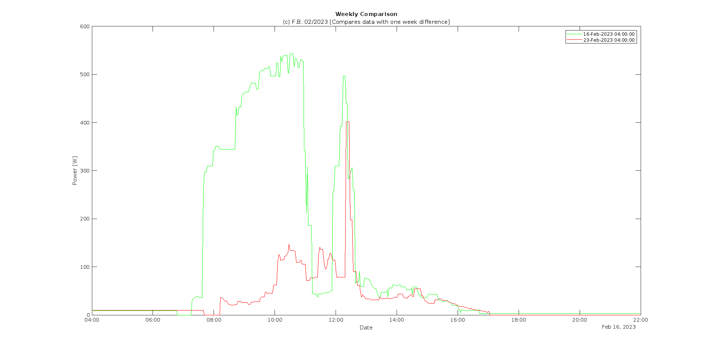
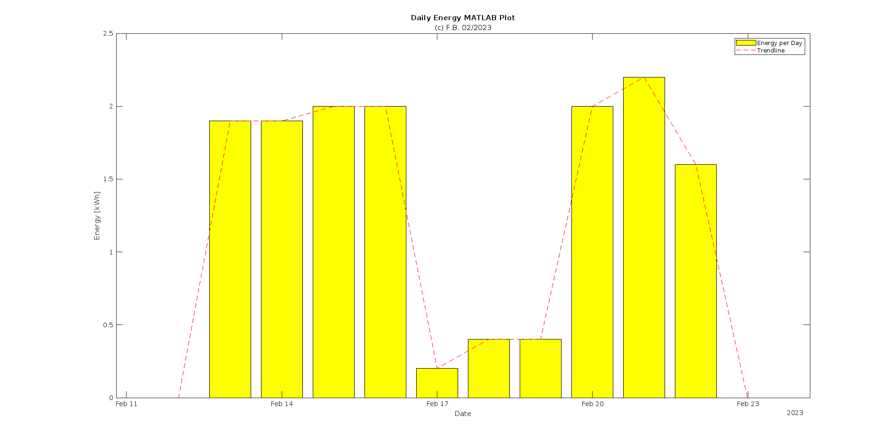
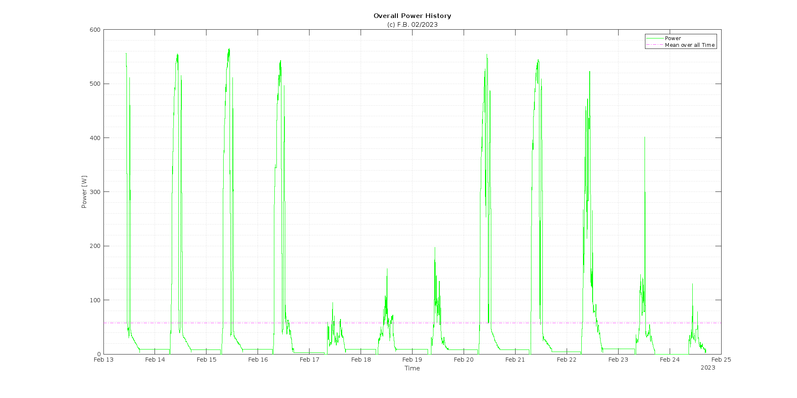

# growattlogger
This sketch is intended to run on an ESP32 and reads data from Growatt Solar Inverters over RS485 Modbus. 

It is designed to work with MIC 600 TL-X Solar-Inverters, however other Growatt Inverters might also work with slight modifications.

In addition a W5500 Ethernet controller is used for IP/TCP connection to the Thingspeak Server to perform HTTP requests. However the provided code will also run perfectly if you exchange the Ethernet Client with a WiFi Client provided by the default ESP WiFi Libray.
To comunicate with the inverter via RS485/Modbus a MAX485 Transceiver is used, other equivalent transceivers might work as well.

The script is logging inverter performance data to the [Thingspeak IoT Cloud](https://thingspeak.com/ "Thingspeak IoT Cloud") to provide nice MATLAB plots of the inverter performance.

# Some example MATLAB plots:

:de: © F.Bisinger 2023